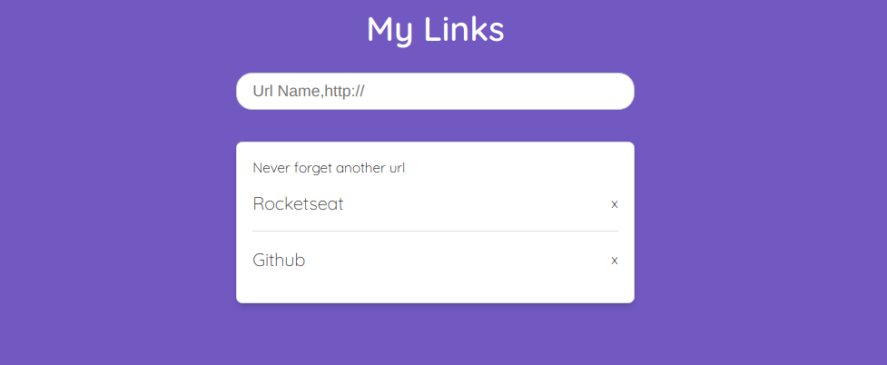

# Save-URLs 🔗

<h1>
  
</h1>

## 🚀 About

Save-URLs is a Link saver. This project was developed to improve my Nodejs study :) and based on [THIS](https://www.youtube.com/watch?v=DiXbJL3iWVs&list=PLK_m105VcD-sN2TfTErrLhyYXg7q4Hrl-&index=1&ab_channel=Rocketseat) video. You can type the name of your link and than the URL.

### 📋 Precondition

This project needs NodeJS. If you do not have NodeJS installed, just follow [THIS](https://nodejs.org) link and install the LTS version.

### 👨‍💻 How to Setup

```bash
  # Clone the project
  $ git clone https://github.com/Levis44/Save-URLs.git
```

To execute the project, just run this code this commands:
```sh
  $ cd Save-URLs # acces the folder 
  $ npm init -y # inicialize the package.json
  $ npm install express body-parser # installing express, body parser and cors
  $ node server.js # running the node server
```

## 🛠️ Tools

* [NodeJS](https://nodejs.org) 
* [HTML](https://html5.org/) 
* [CSS](https://developer.mozilla.org/pt-BR/docs/Web/CSS) 
* [JS](https://js.org/) 

## 📝 License

This project is under the MIT license. See the file [LICENSE.md](LICENSE) for more details.

---

<p align="center">Done by Levi Bernardelli Ciarrocchi ✌🏼</p>